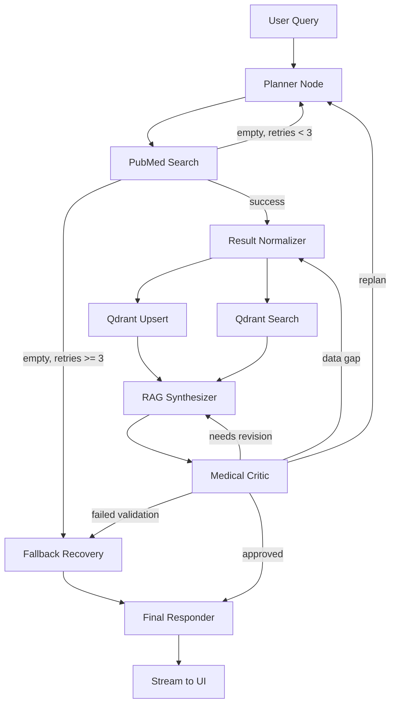

# Specification: Multi-Agent Medical Literature Assistant (MARS)

**Version:** 2.0.0
**Status:** Draft

---

## 1. System Goals & Use Cases

MARS (Multi-Agent Medical Research System) is a professional-grade **medical literature research and decision-support platform**. It is NOT a simple chatbot — it is an AI Agent system capable of autonomously planning research tasks.

### Use Case A: Autonomous Medical Research
A user poses a complex clinical question (e.g., *"Analysis of Side Effects of New GLP-1 Medications"*). The system autonomously decomposes keywords, retrieves literature from PubMed, performs data cleansing, stores results in a Qdrant vector database, and conducts deep RAG (Retrieval-Augmented Generation) Q&A.

### Use Case B: Medical Terminology Translation & Visualization
For complex medical terms found in literature, the system provides comparative explanations and supports text-to-image capabilities to visualize pathological descriptions for enhanced understanding.

---

## 2. Functional Modules

| Module | Responsibility | Key Technologies |
|--------|---------------|------------------|
| **Agentic Orchestrator** | LangGraph-based state machine controlling task flow | LangGraph, Pydantic |
| **Data Pipeline** | PubMed XML parsing, text chunking, data cleansing | httpx, XML ElementTree |
| **Vector Engine** | High-dimensional vector storage & metadata filtering | Qdrant (qdrant-client) |
| **Knowledge Base** | Persistent storage for conversation history, metadata & permissions | PostgreSQL |
| **Async Worker** | Scheduled updates for latest medical domain papers | asyncio, TaskGroup |
| **Interactive UI** | Streaming output & medical image display | FastAPI, Jinja2, NDJSON |

---

## 3. Agent Personas (Multi-Agent Collaboration)

The system uses a multi-agent collaboration model with 4 specialized roles:

### 3.1 Planner Agent
- **Responsibility**: Receives user queries; decomposes them into search keywords, date ranges, and research focus areas.
- **Input**: `user_query.*`, `telemetry.error_flags`
- **Output**: `planning.plan_steps`, `pubmed.latest_query`, reset retry counters
- **Fallback**: When detecting persistent failures, modifies `fallback.events`

### 3.2 Researcher Agent (Tool Runner)
- **Responsibility**: Operates PubMed API tools for precise retrieval and data collection.
- **Input**: `pubmed.latest_query`
- **Output**: `pubmed.results`, `pubmed.query_history`
- **On Empty Results**: Increments `pubmed.empty_retry_count`, pushes to `telemetry.error_flags`

### 3.3 Librarian Agent (Qdrant Specialist)
- **Responsibility**: Manages vector database upsert operations and hybrid search retrieval.
- **Input**: Normalized chunks from Result Normalizer
- **Output**: `qdrant.upsert_metrics`, `qdrant.search_results`
- **On Failure**: Writes to `qdrant.health` and `fallback.events`

### 3.4 Medical Critic Agent
- **Responsibility**: Reviews RAG-generated content for outdated information, medical logic errors, and provides terminology explanations.
- **Input**: `rag.answer_draft`, `rag.context_bundle`
- **Output**: `critic.findings`, `critic.trust_score`, `critic.revision_required`

---

## 4. LangGraph State Machine Architecture

### 4.1 Core State Structure (`LangGraphState`)

```
LangGraphState
├── user_query: UserQueryState
│   ├── raw_prompt: str
│   ├── normalized_terms: list[str]
│   └── constraints: dict[str, Any]          # date range, population, study type
├── planning: PlanningState
│   ├── iteration: int
│   ├── plan_steps: list[PlanStep]
│   └── status: Literal["pending","running","succeeded","degraded","failed"]
├── pubmed: PubMedState
│   ├── latest_query: PubMedQuery | None
│   ├── query_history: list[PubMedQueryLog]
│   ├── results: list[PubMedDocument]
│   └── empty_retry_count: int               # CRITICAL: used for loop prevention
├── qdrant: QdrantState
│   ├── collection_ready: bool
│   ├── upsert_metrics: list[BatchTelemetry]
│   ├── search_results: list[QdrantSearchRecord]
│   └── health: Literal["healthy","degraded","unavailable"]
├── rag: RagState
│   ├── context_bundle: list[ContextChunk]
│   ├── synthesis_notes: list[str]
│   └── answer_draft: str | None
├── critic: CriticState
│   ├── findings: list[CriticFeedback]
│   ├── trust_score: float
│   └── revision_required: bool
├── telemetry: TelemetryState
│   ├── tool_invocations: list[ToolCallMetric]
│   ├── active_tasks: dict[str, TaskStatus]
│   ├── error_flags: list[ErrorSignal]
│   └── correlation_id: str | None
├── fallback: FallbackState
│   ├── events: list[FallbackEvent]
│   └── terminal_reason: str | None
├── ui: UIState
│   ├── stream_anchor: str
│   └── partial_updates: list[StreamUpdate]
├── extensions: dict[str, Any]
├── status: Literal["idle","running","succeeded","failed","degraded","cancelled"]
├── current_node: str | None
├── retry_counters: dict[str, int]
├── created_at: datetime
└── updated_at: datetime
```

### 4.2 Node Pipeline (9 Nodes)

| # | Node | Role | Key Operations |
|---|------|------|----------------|
| 1 | `planner` | Planner | Query decomposition, keyword planning, step assignment |
| 2 | `pubmed_search` | Researcher | PubMed API search, fetch details/summaries |
| 3 | `result_normalizer` | System | Parse PubMed articles → ContextChunks, generate UUID v5 IDs, create vectors |
| 4 | `qdrant_upsert` | Librarian | Batch upsert vectors to Qdrant (parallel with search) |
| 5 | `qdrant_search` | Librarian | Semantic similarity search in Qdrant (parallel with upsert) |
| 6 | `rag_synthesizer` | System | Combine context + plan → generate answer draft |
| 7 | `medical_critic` | Critic | Review answer for accuracy, assign trust score |
| 8 | `fallback_recovery` | System | Handle degradation: use cache, report, or terminate |
| 9 | `final_responder` | System | Generate final response, emit to UI stream |

### 4.3 Conditional Edges & Loop Prevention

#### Scenario A: PubMed Empty Results
```
pubmed_search → [empty_retry_count < 3] → planner (retry with new keywords)
pubmed_search → [empty_retry_count >= 3] → fallback_recovery (forced degradation)
fallback_recovery → final_responder
```

#### Scenario B: Medical Critic Rejection
```
medical_critic → [content issue] → rag_synthesizer (revise draft)
medical_critic → [data gap] → result_normalizer (expand chunks)
medical_critic → [planning issue] → planner (replan)
medical_critic → [multiple failures] → fallback_recovery
medical_critic → [approved] → final_responder
```

### 4.4 Flow Diagram



---

## 5. External Tool Wrappers

### 5.1 PubMedWrapper (`src/clients/pubmed_wrapper.py`)

**Initialization Parameters:**
- `async_client: httpx.AsyncClient` — Connection pooling & timeout
- `rate_limiter: AsyncRateLimiter` — Token bucket implementation
- `api_key: str | None` — Increases NCBI rate limit from 3 to 10 req/sec
- `tool_name: str` & `email: str` — NCBI usage policy compliance
- `max_retries: int`, `retry_backoff: tuple[float, float]`

**Public Async Methods:**
- `search(query: PubMedQuery) → PubMedSearchResult`
- `fetch_details(ids: list[str]) → PubMedBatch`
- `fetch_summaries(ids: list[str]) → list[PubMedSummary]`
- `warm_up() → None`

**Error Hierarchy:** `PubMedError` → `PubMedRateLimitError`, `PubMedHTTPError`, `PubMedParseError`, `PubMedEmptyResult`

### 5.2 QdrantWrapper (`src/clients/qdrant_wrapper.py`)

**Initialization Parameters:**
- `client: AsyncQdrantClient`
- `collection: str`, `vector_size: int`, `distance: str`
- `max_batch_size: int`, `timeout: float`

**Public Async Methods:**
- `ensure_collection(config) → None`
- `upsert(records: Sequence[QdrantRecord]) → QdrantUpsertResult`
- `query(request: QdrantQuery) → QdrantQueryResult`
- `delete(point_ids: Sequence[str]) → QdrantDeleteResult`
- `healthcheck() → QdrantHealthStatus`

**Error Hierarchy:** `QdrantError` → `QdrantConnectivityError`, `QdrantSchemaError`, `QdrantConsistencyError`, `QdrantTimeoutError`

---

## 6. API & UI Layer

### 6.1 FastAPI Backend (`src/app/`)
- **Entry Point**: `create_app()` in `src/app/server.py`
- **Streaming Endpoint**: `POST /api/research` — Returns NDJSON stream
- **UI Endpoint**: `GET /ui` — Jinja2 template with SSE/Fetch API

### 6.2 Streaming Protocol (NDJSON Events)
```jsonc
{"event": "update", "segment": "planner", "content": "Planning search strategy..."}
{"event": "update", "segment": "pubmed_search", "content": "Found 8 articles..."}
{"event": "update", "segment": "final", "final": true, "content": "Summary text..."}
{"event": "summary", "status": "succeeded", "telemetry": {...}}
{"event": "complete", "status": "succeeded", "correlation_id": "..."}
```

### 6.3 Request/Response Format
**Request:**
```json
{"query": "What are the latest treatments for type 2 diabetes?", "max_articles": 3}
```
**Response:** NDJSON stream with `update`, `summary`, and `complete` events.

---

## 7. Infrastructure

### 7.1 Docker Services
| Service | Image | Ports | Volumes |
|---------|-------|-------|---------|
| `mars_qdrant` | `qdrant/qdrant:latest` | 6333 (REST), 6334 (gRPC) | `qdrant_data` |
| `mars_postgres` | `postgres:15-alpine` | 5432 | `postgres_data` |

### 7.2 Environment Variables
| Category | Variable | Description | Default |
|----------|----------|-------------|---------|
| PubMed | `PUBMED_API_KEY` | NCBI API key | (empty, required) |
| PubMed | `PUBMED_TOOL_NAME` | Tool identifier for NCBI | `mars-test-suite` |
| PubMed | `PUBMED_EMAIL` | Contact email for NCBI | (empty) |
| PubMed | `PUBMED_RATE_REQUESTS` | Requests per period | `3` |
| PubMed | `PUBMED_RATE_PERIOD` | Rate limit window (seconds) | `1.0` |
| Qdrant | `QDRANT_HOST` | Qdrant server host | `localhost` |
| Qdrant | `QDRANT_PORT` | Qdrant REST port | `6333` |
| Qdrant | `QDRANT_COLLECTION` | Default collection name | `mars-test` |
| Qdrant | `QDRANT_VECTOR_SIZE` | Embedding dimension | `8` |
| Qdrant | `QDRANT_DISTANCE` | Distance metric | `COSINE` |
| Postgres | `POSTGRES_DB` | Database name | `mars` |
| Postgres | `POSTGRES_USER` | Database user | `mars_admin` |
| Postgres | `POSTGRES_PASSWORD` | Database password | `changeme` |

### 7.3 Python Dependencies
```
fastapi, uvicorn[standard], httpx, langgraph, langchain, langchain-core,
qdrant-client<1.17.0, pydantic, pydantic-settings, python-dotenv,
jinja2, python-multipart, pytest, pytest-asyncio, pytest-anyio, ruff
```

---

## 8. Development Phases

| Phase | Name | Deliverables |
|-------|------|-------------|
| 1 | Infrastructure Setup | Docker Compose, service connectivity verification |
| 2 | Schema Design | Qdrant collection structure, SQL tables, Pydantic models |
| 3 | Core Tooling | PubMed/Qdrant wrappers with unit tests |
| 4 | Orchestrator | LangGraph state machine with conditional edges & fallback |
| 5 | UI & Integration | FastAPI endpoints, streaming UI, E2E tests |
| 6 | Deployment & Quality | Monitoring, rollback strategy, QA test matrix |

---

## 9. Verification Requirements

### 9.1 Automated Tests
- `pytest` for all wrapper methods (success, rate limit, retry, parse error, empty result)
- `pytest-asyncio` for async test cases
- E2E test for `/api/research` endpoint with streaming validation

### 9.2 Manual Verification
- Start server with `uvicorn src.app.server:create_app --factory --port 8000`
- Send test query via `curl -X POST http://localhost:8000/api/research -H "Content-Type: application/json" -d '{"query": "diabetes", "max_articles": 1}'`
- Verify NDJSON stream contains `update`, `summary`, and `complete` events
- Verify `status: "succeeded"` in summary event
- Verify all tool invocations show `status: "success"` in telemetry
