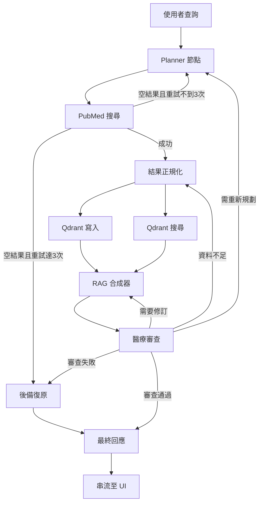

# 規格說明書：多代理醫學文獻助理 (MARS)

**版本：** 2.0.0
**狀態：** 草稿 (Draft)

---

## 1. 系統目標與使用情境

MARS (Multi-Agent Medical Research System) 是一個專業級的**醫療文獻研究與決策輔助平台**。本系統不是單純的聊天機器人，而是一個能夠自主規劃研究任務的 AI Agent 系統。

### 使用情境 A：自主醫學研究
使用者提出複雜的臨床問題（例如：*「分析新型 GLP-1 藥物的副作用」*）。系統會自主拆解關鍵字、從 PubMed 抓取文獻、進行數據清洗、並存入 Qdrant 向量資料庫進行深度的 RAG (Retrieval-Augmented Generation) 問答。

### 使用情境 B：醫療專有名詞轉譯與可視化
針對文獻中艱澀的專有名詞（Medical Terms），系統提供對比解釋，並具備文字轉圖片（Text-to-Image）功能，將病理描述視覺化以輔助理解。

---

## 2. 功能模組

| 模組 | 職責 | 關鍵技術 |
|------|------|----------|
| **代理編排 (Orchestrator)** | 基於 LangGraph 的狀態機控制任務流轉 | LangGraph, Pydantic |
| **資料流水線 (Data Pipeline)** | PubMed XML 解析、文本切片 (Chunking)、資料清洗 | httpx, XML ElementTree |
| **向量引擎 (Vector Engine)** | 高維度向量存儲與元數據過濾 (Metadata Filtering) | Qdrant (qdrant-client) |
| **知識庫 (Knowledge Base)** | 持久化儲存對話紀錄、文獻元數據與系統權限 | PostgreSQL |
| **背景任務 (Async Worker)** | 定期更新特定醫療領域的最新論文摘要 | asyncio, TaskGroup |
| **互動介面 (Interactive UI)** | 流式輸出 (Streaming) 與醫學影像顯示 | FastAPI, Jinja2, NDJSON |

---

## 3. 代理角色 (多代理協作模式)

本系統採用 4 個專業化角色的多代理協作模式：

### 3.1 Planner Agent (計畫代理人)
- **職責**：接收使用者查詢，將其拆解為搜尋關鍵字、日期範圍與研究重點。
- **輸入**：`user_query.*`、`telemetry.error_flags`
- **輸出**：`planning.plan_steps`、`pubmed.latest_query`、重設重試計數器
- **後備策略**：偵測到持續失敗時，修改 `fallback.events`

### 3.2 Researcher Agent (研究員代理人 — 工具執行者)
- **職責**：操作 PubMed API 工具進行精準檢索與資料採集。
- **輸入**：`pubmed.latest_query`
- **輸出**：`pubmed.results`、`pubmed.query_history`
- **空結果處理**：遞增 `pubmed.empty_retry_count`，推送至 `telemetry.error_flags`

### 3.3 Librarian Agent (圖書館員代理人 — Qdrant 專家)
- **職責**：管理向量資料庫的 upsert 操作與混合搜尋 (Hybrid Search) 檢索邏輯。
- **輸入**：來自 Result Normalizer 的正規化切片 (Chunks)
- **輸出**：`qdrant.upsert_metrics`、`qdrant.search_results`
- **失敗處理**：寫入 `qdrant.health` 和 `fallback.events`

### 3.4 Medical Critic Agent (醫療審查代理人)
- **職責**：審核 RAG 生成的內容，檢查是否包含過時資訊或醫學邏輯錯誤，並負責名詞解釋。
- **輸入**：`rag.answer_draft`、`rag.context_bundle`
- **輸出**：`critic.findings`、`critic.trust_score`、`critic.revision_required`

---

## 4. LangGraph 狀態機架構

### 4.1 核心狀態結構 (`LangGraphState`)

```
LangGraphState
├── user_query: UserQueryState
│   ├── raw_prompt: str                      # 原始提問
│   ├── normalized_terms: list[str]          # Planner 正規化後的關鍵詞
│   └── constraints: dict[str, Any]          # 日期範圍、族群、研究類型
├── planning: PlanningState
│   ├── iteration: int                       # 當前迭代次數
│   ├── plan_steps: list[PlanStep]           # 既定子任務
│   └── status: Literal[...]                 # 整體狀態旗標
├── pubmed: PubMedState
│   ├── latest_query: PubMedQuery | None     # 最近一次關鍵字組合
│   ├── query_history: list[PubMedQueryLog]  # 重試紀錄
│   ├── results: list[PubMedDocument]        # 累積文獻結果
│   └── empty_retry_count: int               # ★ 關鍵：用於迴圈預防
├── qdrant: QdrantState
│   ├── collection_ready: bool               # 集合是否已準備
│   ├── upsert_metrics: list[BatchTelemetry] # 批次寫入指標
│   ├── search_results: list[QdrantSearchRecord] # 檢索命中
│   └── health: Literal[...]                 # 健康度
├── rag: RagState
│   ├── context_bundle: list[ContextChunk]   # 整理後的 chunk
│   ├── synthesis_notes: list[str]           # 合成提示備註
│   └── answer_draft: str | None             # 草稿回答
├── critic: CriticState
│   ├── findings: list[CriticFeedback]       # 審查發現
│   ├── trust_score: float                   # 可信度評分
│   └── revision_required: bool              # 是否需回滾
├── telemetry: TelemetryState
│   ├── tool_invocations: list[ToolCallMetric]   # 工具延遲追蹤
│   ├── active_tasks: dict[str, TaskStatus]      # 非同步任務狀態
│   ├── error_flags: list[ErrorSignal]           # 錯誤訊號
│   └── correlation_id: str | None               # 關聯 ID
├── fallback: FallbackState
│   ├── events: list[FallbackEvent]          # 降級策略紀錄
│   └── terminal_reason: str | None          # 最終終止原因
├── ui: UIState
│   ├── stream_anchor: str                   # 串流錨點
│   └── partial_updates: list[StreamUpdate]  # 增量輸出
├── extensions: dict[str, Any]               # 擴充保留
├── status: Literal[...]                     # 全域狀態
├── current_node: str | None                 # 當前節點
├── retry_counters: dict[str, int]           # 重試計數器
├── created_at: datetime
└── updated_at: datetime
```

### 4.2 節點流程 (9 個節點)

| # | 節點名稱 | 角色 | 關鍵操作 |
|---|----------|------|----------|
| 1 | `planner` | 計畫代理人 | 查詢分解、關鍵字規劃、步驟分配 |
| 2 | `pubmed_search` | 研究員 | PubMed API 搜尋、取得細節/摘要 |
| 3 | `result_normalizer` | 系統 | 解析 PubMed 文章 → ContextChunks，產生 UUID v5 ID，建立向量 |
| 4 | `qdrant_upsert` | 圖書館員 | 批次將向量寫入 Qdrant（與搜尋平行執行） |
| 5 | `qdrant_search` | 圖書館員 | 在 Qdrant 中進行語義相似度搜尋（與寫入平行執行） |
| 6 | `rag_synthesizer` | 系統 | 結合上下文 + 計畫 → 合成回答草稿 |
| 7 | `medical_critic` | 審查代理人 | 審查回答的準確性，給予可信度評分 |
| 8 | `fallback_recovery` | 系統 | 處理降級：使用快取、回報或終止 |
| 9 | `final_responder` | 系統 | 生成最終回應，發送至 UI 串流 |

### 4.3 條件邊與迴圈預防

#### 場景 A：PubMed 搜尋結果為空
```
pubmed_search → [empty_retry_count < 3] → planner (用新關鍵字重試)
pubmed_search → [empty_retry_count >= 3] → fallback_recovery (強制降級)
fallback_recovery → final_responder
```

#### 場景 B：Medical Critic 審查不通過
```
medical_critic → [內容問題] → rag_synthesizer (修訂草稿)
medical_critic → [資料不足] → result_normalizer (擴充 chunks)
medical_critic → [規劃問題] → planner (重新規劃)
medical_critic → [多次失敗] → fallback_recovery
medical_critic → [審查通過] → final_responder
```

### 4.4 流程圖



---

## 5. 外部工具封裝

### 5.1 PubMedWrapper (`src/clients/pubmed_wrapper.py`)

**初始化參數：**
- `async_client: httpx.AsyncClient` — 連線池與逾時設定
- `rate_limiter: AsyncRateLimiter` — Token bucket 實作
- `api_key: str | None` — 將 NCBI 速率限制從 3 提升至 10 req/sec
- `tool_name: str` 與 `email: str` — 符合 NCBI 使用政策
- `max_retries: int`、`retry_backoff: tuple[float, float]`

**公開非同步方法：**
- `search(query: PubMedQuery) → PubMedSearchResult`
- `fetch_details(ids: list[str]) → PubMedBatch`
- `fetch_summaries(ids: list[str]) → list[PubMedSummary]`
- `warm_up() → None`

**錯誤階層：** `PubMedError` → `PubMedRateLimitError`、`PubMedHTTPError`、`PubMedParseError`、`PubMedEmptyResult`

### 5.2 QdrantWrapper (`src/clients/qdrant_wrapper.py`)

**初始化參數：**
- `client: AsyncQdrantClient`
- `collection: str`、`vector_size: int`、`distance: str`
- `max_batch_size: int`、`timeout: float`

**公開非同步方法：**
- `ensure_collection(config) → None`
- `upsert(records: Sequence[QdrantRecord]) → QdrantUpsertResult`
- `query(request: QdrantQuery) → QdrantQueryResult`
- `delete(point_ids: Sequence[str]) → QdrantDeleteResult`
- `healthcheck() → QdrantHealthStatus`

**錯誤階層：** `QdrantError` → `QdrantConnectivityError`、`QdrantSchemaError`、`QdrantConsistencyError`、`QdrantTimeoutError`

---

## 6. API 與使用者介面層

### 6.1 FastAPI 後端 (`src/app/`)
- **進入點**：`src/app/server.py` 中的 `create_app()`
- **串流端點**：`POST /api/research` — 回傳 NDJSON 串流
- **UI 端點**：`GET /ui` — Jinja2 模板搭配 SSE/Fetch API

### 6.2 串流協議 (NDJSON 事件)
```jsonc
{"event": "update", "segment": "planner", "content": "正在規劃搜尋策略..."}
{"event": "update", "segment": "pubmed_search", "content": "找到 8 篇文章..."}
{"event": "update", "segment": "final", "final": true, "content": "總結文字..."}
{"event": "summary", "status": "succeeded", "telemetry": {...}}
{"event": "complete", "status": "succeeded", "correlation_id": "..."}
```

### 6.3 請求/回應格式
**請求：**
```json
{"query": "第二型糖尿病的最新治療方式有哪些？", "max_articles": 3}
```
**回應：** 包含 `update`、`summary` 和 `complete` 事件的 NDJSON 串流。

---

## 7. 基礎設施

### 7.1 Docker 服務
| 服務 | 映像 | 通訊埠 | 持久化 Volume |
|------|------|--------|---------------|
| `mars_qdrant` | `qdrant/qdrant:latest` | 6333 (REST), 6334 (gRPC) | `qdrant_data` |
| `mars_postgres` | `postgres:15-alpine` | 5432 | `postgres_data` |

### 7.2 環境變數
| 類別 | 變數 | 說明 | 預設值 |
|------|------|------|--------|
| PubMed | `PUBMED_API_KEY` | NCBI API 金鑰 | （空，必填） |
| PubMed | `PUBMED_TOOL_NAME` | NCBI 工具識別碼 | `mars-test-suite` |
| PubMed | `PUBMED_EMAIL` | NCBI 聯繫信箱 | （空） |
| PubMed | `PUBMED_RATE_REQUESTS` | 每段時間允許的請求數 | `3` |
| PubMed | `PUBMED_RATE_PERIOD` | 速率限制時間窗口 (秒) | `1.0` |
| Qdrant | `QDRANT_HOST` | Qdrant 伺服器主機 | `localhost` |
| Qdrant | `QDRANT_PORT` | Qdrant REST 通訊埠 | `6333` |
| Qdrant | `QDRANT_COLLECTION` | 預設集合名稱 | `mars-test` |
| Qdrant | `QDRANT_VECTOR_SIZE` | 嵌入向量維度 | `8` |
| Qdrant | `QDRANT_DISTANCE` | 距離度量 | `COSINE` |
| Postgres | `POSTGRES_DB` | 資料庫名稱 | `mars` |
| Postgres | `POSTGRES_USER` | 資料庫帳號 | `mars_admin` |
| Postgres | `POSTGRES_PASSWORD` | 資料庫密碼 | `changeme` |

### 7.3 Python 依賴套件
```
fastapi, uvicorn[standard], httpx, langgraph, langchain, langchain-core,
qdrant-client<1.17.0, pydantic, pydantic-settings, python-dotenv,
jinja2, python-multipart, pytest, pytest-asyncio, pytest-anyio, ruff
```

---

## 8. 開發階段

| 階段 | 名稱 | 交付物 |
|------|------|--------|
| 1 | 基礎設施建置 | Docker Compose、服務連通性驗證 |
| 2 | Schema 設計 | Qdrant 集合結構、SQL 表、Pydantic 模型 |
| 3 | 核心工具封裝 | PubMed/Qdrant 封裝層與單元測試 |
| 4 | Orchestrator | LangGraph 狀態機、條件邊與後備策略 |
| 5 | UI 與整合測試 | FastAPI 端點、串流 UI、端到端 (E2E) 測試 |
| 6 | 部署與品質保證 | 監控、回滾策略、QA 測試矩陣 |

---

## 9. 驗證要求

### 9.1 自動化測試
- `pytest` 覆蓋所有封裝層方法（成功、速率限制、重試、解析錯誤、空結果）
- `pytest-asyncio` 進行非同步測試案例
- 針對 `/api/research` 端點的 E2E 測試（含串流驗證）

### 9.2 手動驗證
- 啟動伺服器：`uvicorn src.app.server:create_app --factory --port 8000`
- 發送測試查詢：`curl -X POST http://localhost:8000/api/research -H "Content-Type: application/json" -d '{"query": "diabetes", "max_articles": 1}'`
- 驗證 NDJSON 串流包含 `update`、`summary` 和 `complete` 事件
- 驗證 summary 事件中的 `status: "succeeded"`
- 驗證遙測資料中所有工具呼叫顯示 `status: "success"`
